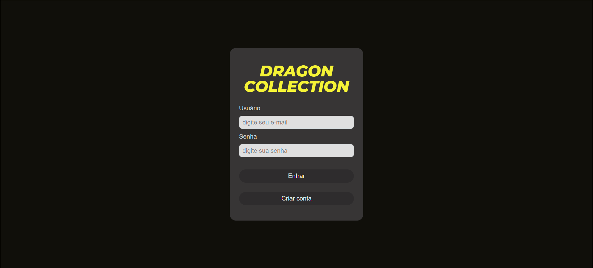
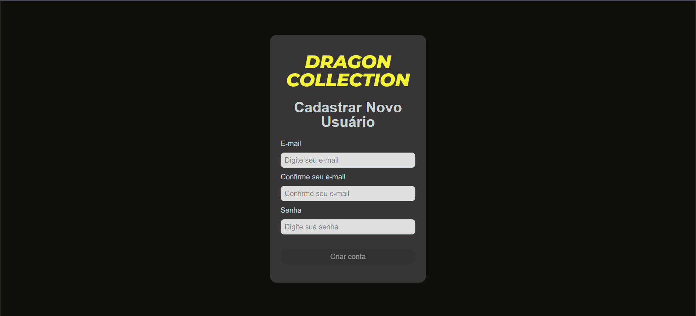
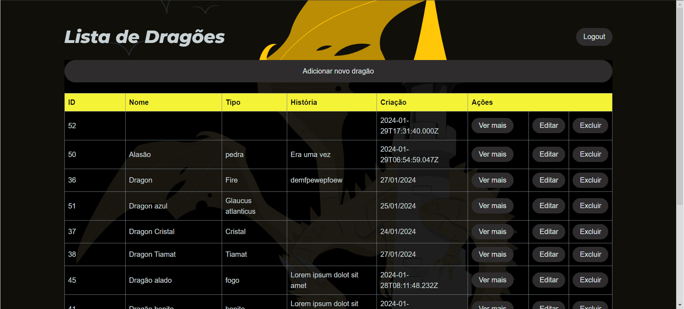
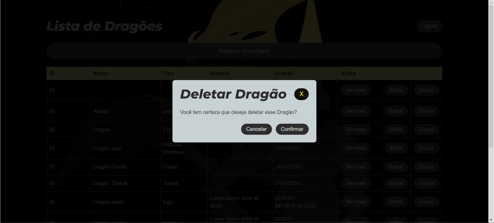
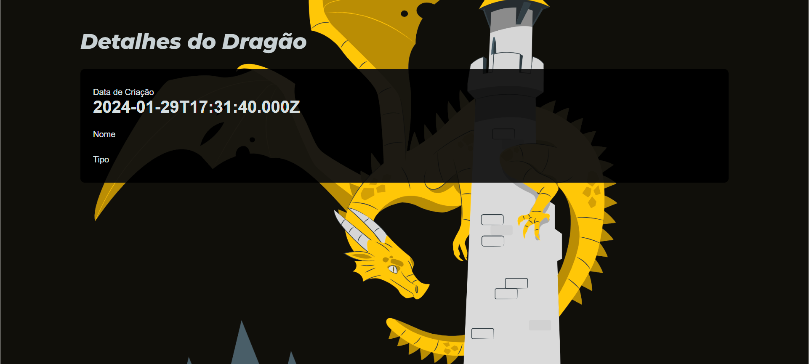
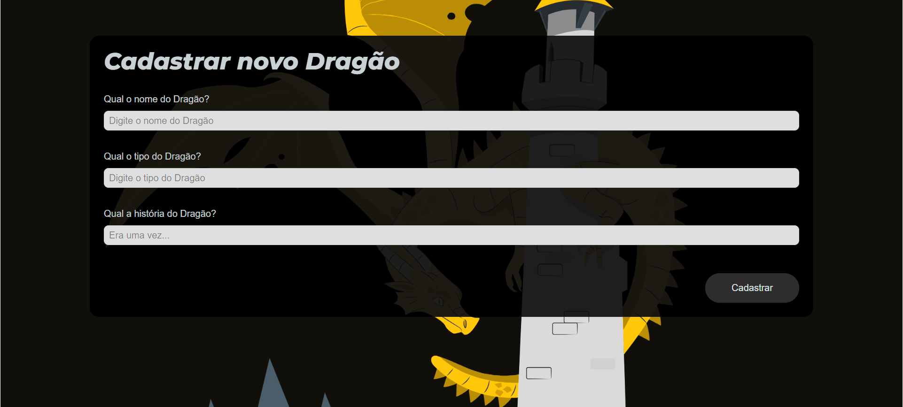
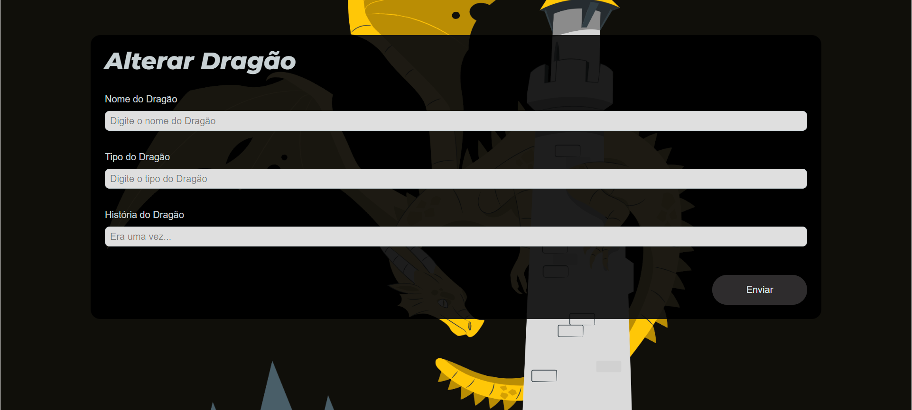

# Collection Dragon

Aplicação para cadastro de Dragões!

## Desenvolvido utilizando:

- ### React JS + TypeScript
- ### Vite

[Vite](https://vitejs.dev/) para criar o projeto.

- ### React Router

[React Router](https://reactrouter.com/en/main) para gerenciamento de rotas.

### Axios

[Axios](https://axios-http.com/) para realizar as requisições.

### Sass

[Sass](https://sass-lang.com/) para organização dos estilos.

### Git e GitHub

Git e [Github](https://github.com/) para versionamento.

- Node version: 20.3.1

## Processo de Desenvolvimento

Para o presente projeto foram desenvolvidos as seguintes telas:

### Acesso ao sistema e cadastro de novo usuário

path: /signin



path: /signup



### Página inicial

path: /

Página inicial, contém a listagem de dragões cadastrados com possibilidade de exclusão e edição dos mesmo, ou criação de um novo Dragão.





### Página de detalhe

path: /dragon/:id
Página de detalhe do Dragão, pode ser acessada atráves do botão "ver mais" apresentado em cada item da lista de dragões da página inicial.



### Página de cadastro de novo Dragão

path: /dragon/new
Página de cadastro de um novo Dragão, pode ser acessada atráves do botão "Adicionar novo dragão", posicionado acima da listagem de Dragões da página inicial.



### Página para alterar um Dragão

path: /dragon/edit/:id
Página de edição de um Dragão, pode ser acessada atráves do botão "editar" apresentado em cada item da lista de dragões da página inicial.



### Componentes utilizados

No desenvolvimento deste projeto, não foi utilizado nenhuma biblioteca de compotenetes (Material-ui, ant-design, ...), todos os compoentes aqui utilizados foram desenvolvidos dentro do próprio projeto.

## Melhorias futuras

- adição de testes unitários.
- criação de um Navbar com o nome do APP e ações do usuário.

## Para executar o projeto

### clone o repositório

Endereço:

```
https://github.com/guilhermelaureano/dragon-collection
```

### Instalação

Após clonar o projeto em sua máquina local, vá até o diretório onde o projeto está localizado e digite o comando:

```
npm install
```

Obs: Verifique a sua versão do Node, no momento do deste desenvolvimento utilizamos a versão Node version: 20.3.1.

### Subir o projeto localmente

Após a instalação, podemos executar o projeto:

```
npm run dev
```
